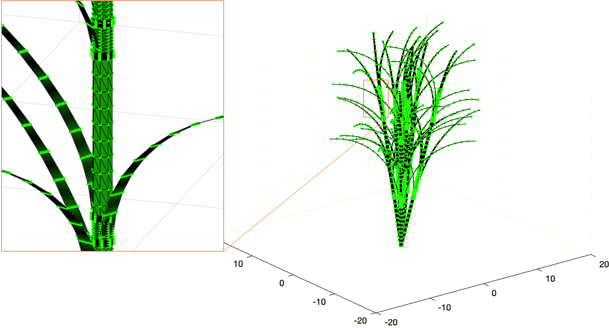

# **3D Rice - Using computational geometry**

The proposed methodology generates 3D models, with rice plants as the case study. The first stage involves plant morphology characterization, the second stage applies computer graphics and computational geometry techniques, including point cloud generation, Delaunay triangulation, and plant composition. Finally, a genetic approach is used to coordinate the generation of plant architecture.

Rice plants exhibit different geometric architectures depending on the biological stage. This study covers the vegetative stage, specifically at an intermediate point in the process, with plants that have not yet developed panicles. The approach is based on the plant's morphology

  

**The point cloud density** for each polygon is determined, with the cylinder being the optimal model for the node, inter-node, and leaf shapes. Initially 2D, the point cloud uses coordinates (u, v) ranging from 0 to 2π for nodes and inter-nodes, completing the cylinder's revolution, and from 0 to π/4 for leaves, representing an incomplete cylinder circle. 

**Delaunay triangulation** is ideal for generating interconnections between point clouds, offering efficient integration with visualization and animation tools due to its lightweight structure for lighting and shading algorithms. These interconnection points form the 3D model's topology.

  

  

# **3D Rice - .OBJ file**
The final step is to create the **.OBJ file**, which models the 3D object. This model integrates topological information from the point cloud, geometric data from the Delaunay triangulation, and the normal vectors associated with each point. Figure shows the .OBJ model visualization. At this point, the methodology generates a single 3D model.

  

